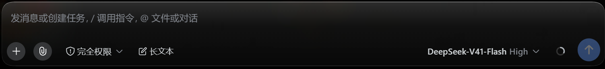
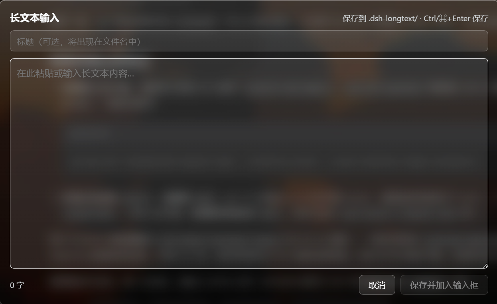

# dsh-longtext-input

> DeepSeek Harness 长文本输入插件：把超长内容写进工作区文件，输入框只留一个 `@` 引用。

[English](./README_EN.md) · [MIT License](./LICENSE)

在输入框工具栏加一个**「长文本」**按钮，点开编辑器，保存后：

```
写入 <工作区>/.dsh-longtext/<YYYYMMDDHHmmss>_<标题>.md
输入框追加 @.dsh-longtext/<文件名>.md
```

用途是**保持聊天界面简洁**：粘贴报错日志、会议记录、文档草稿这类超长内容时，正文留在文件里，聊天记录不被一大坨文字撑满。

DSH 的输入框本身没有长度上限，所以本插件的定位不是"绕过限制"，而是**把长正文请出对话流**。

## 效果

其中，背景画面与毛玻璃效果由其它插件产生，与本插件无关。




## 行为

| 项       | 规则                                         |
| ------- | ------------------------------------------ |
| 文件名     | `14位本地时间_标题.md`，如 `20260712153045_会议记录.md` |
| 标题为空    | `20260712153045.md`（省略 `_标题`）              |
| 标题清洗    | 去掉 `/` `\` `<` `>` `:` `"` `\|` `?` `*` 与控制字符，空白→`_`，去首尾 `_`/`.`，最长 60 字符 |
| 落盘位置    | 当前会话工作目录下的 `.dsh-longtext/`，不存在时自动创建       |
| 输入框既有内容 | **保留**。引用另起一行追加到末尾；仅当输入框为空时直接放入            |
| 引用形态    | `@` + 工作区相对路径 + 一个空格。**是普通文本，不是引用芯片**      |
| 已保存的正文  | 只存在于文件里，编辑器不保留副本                           |
| 保存成功提示  | 无。输入框里出现的 `@` 引用就是反馈                       |
| 快捷键     | `Ctrl`/`⌘` + `Enter` 保存，`Esc` 取消           |

不预填、不清空、不覆盖你正在写的草稿。

### 关于 `@` 引用是普通文本

DSH 的 `setDraft()` 按纯文本段落重建编辑器，不生成引用芯片（chip）。本插件没有伪造芯片 —— 伪造需要一个在输入触发器注册表里存在的 `source`，那是产品内部实现。因此引用以**字面文本** `@.dsh-longtext/xxx.md` 注入：模型能读到这个路径，你也可以随时手动删掉。

## 安装

**要求 DSH ≥ 0.1.5-rc.1**（web profile）。

```powershell
# 从本地检出安装
dsh plugin --profile web add "D:/path/to/dsh-longtext-input"
```

`dsh plugin add` 会自动把声明了 `dsh.bundle.patch` 的依赖追加进 `dsh.profile.bundles`，无需手改配置。装的是 **link 依赖**，所以改完源码不用重装。

**装完必须重启 DSH** —— Host 半只有重启才装载。

## 卸载

通常第 1 条就够。

### 1. 正常卸载

```powershell
dsh plugin --profile web remove dsh-longtext-input
```

同时移除 profile 依赖与 bundle 层，重启 DSH 生效。

### 2. 手动兜底（第 1 条没生效，或 DSH 已起不来）

编辑 `$DSH_HOME/profiles/web/package.json`：

- `dependencies` 里删掉 `"dsh-longtext-input"` 那一行
- `dsh.profile.bundles` 里删掉 `"dsh-longtext-input"`

然后：

```powershell
cd "$env:USERPROFILE\.dsh\profiles\web"
pnpm install
```

### 3. 禁用而不删除

在 `$DSH_HOME/profiles/web/package.json` 的 `dsh.profile.bundles` 中，把 `"dsh-longtext-input"` 改成一个对象：

```json
{ "id": "longtext-input", "name": "dsh-longtext-input", "disabled": true }
```

保留依赖，只是不装载。适合"先让 DSH 起来，再慢慢查"。

### 排查启动问题

本插件不参与 Host 启动的关键路径（只注册一条 HTTP 路由和两个 UI 槽位，且所有外部依赖读取都有存在性判断），理论上不会阻塞启动。若确实怀疑它：

```powershell
dsh --profile web --dump-config
```

这条命令只组装配置树并退出，不启动服务 —— 输出里 `# == dsh-longtext-input` 那段就是本插件的行。

已落盘的 `.dsh-longtext/` 不会被自动清理，请自行删除。

## 组成

| 半边     | 文件              | 职责                                                         |
| ------ | --------------- | ---------------------------------------------------------- |
| Host   | `lib/index.js`  | 注册 `POST /longtext-input/save`，校验会话与正文，落盘，返回工作区相对路径        |
| Client | `lib/client.js` | 在 `conversation.input.left` 注册按钮，在 `shell.overlay` 注册编辑器浮层 |

两个槽位都用**自己的 id** 注册，纯增量，不顶替任何内置控件。

**零构建、零运行时依赖** —— 两半都是手写的普通 JavaScript。`lib/client.js` 是预构建的客户端 bundle（`window.__ModuleLoader__.load({id, factory})` 形式），`id` 必须是**包名** `dsh-longtext-input`（boot graph 按包名给每个 client 行做键，填成行 id 会让整个插件树在浏览器里加载失败）。

### 为什么落盘在 Host 半

浏览器半被沙箱在页面里，没有文件系统权限。工作目录取自 **Session header 的 `cwd`**（不是客户端猜的路径），所以切换工作区不会写错树。文件名完全由 Host 半生成，客户端只提供标题且标题会被清洗 —— 客户端输入永远不会作为路径片段拼接。

写入用 `node:fs/promises`：`fs.writeText` 拒绝创建缺失的父目录，而 `.dsh-longtext/` 首次使用时并不存在。

## Wallpaper Engine 毛玻璃适配

装了 `dsh-plugin-wallpaper-engine` 并开启壁纸时，长文本浮层自动变成与输入框**同一套**液态玻璃外观，并跟随该插件的「玻璃」/「玻璃透明度」/「玻璃颜色」滑杆实时变化。

做法是纯 CSS、**零代码耦合**：

- 选择器全部限定在 `body[data-we-wallpaper]` —— wallpaper-engine 在壁纸激活时挂到 `<body>` 的稳定属性。插件没装或壁纸关闭时这些规则**一条都不匹配**，外观与不装它时完全一致。
- 复用该插件自己的 CSS 自定义属性（`--we-blur` / `--we-saturate` / `--we-glass-alpha` / `--we-glass-color` …）。它们声明在 `<body>` 上，会继承到浮层（浮层挂在 `document.body` 下），所以滑杆一动浮层跟着动，两边不需要任何协商。
- 每个 `var()` 都带 fallback。

**为什么必须写元素选择器**：`backdrop-filter` 无法用 design token 表达，DSH 也没有提供毛玻璃 token。wallpaper-engine 自己撞的是同一堵墙 —— 它对输入框用 `[data-composer-card]`、对 better-sidebar 用 `[data-dsh-better-sidebar]`，本插件对浮层用 `.dsh-longtext-panel`。三者是同一种做法。

## 开发

```powershell
node scripts/check.mjs
```

离线自检，27 项，覆盖：两半的导出形状、模块加载器注册契约（含注册 id 与包名一致性）、槽位注册、路由行为（含真实写盘到临时目录）、文件名规则、草稿保留语义、按钮对比度、Wallpaper Engine 变量契约与规则隔离性。

其中 Wallpaper Engine 那几项会**读取实际安装的插件源码**做交叉验证；未安装则自动跳过。

改完 `lib/` 后：

- **Client 半**：bundle 变更会被探测并热加载 —— 硬刷新浏览器即可，不用重启 DSH。
- **Host 半**：需要重启 DSH。

## 已知边界

- **模型不会自动读到正文。** DSH 里 `@path` 是给模型看的路径引用，不是内容内联。模型需要自己打开文件；如果它没读，直接告诉它"读一下 .dsh-longtext/xxx.md"。
- **`@` 引用是文本，不是芯片**（见上）。
- **注入采用保存瞬间的草稿。** `setDraft` 是"整份替换"语义，所以保存时读取当前草稿再整体写回。
  - 草稿来自输入框组件对 `useInput` 的**持续镜像**（渲染期同步 + 保存时重读），不是打开编辑器时的快照 —— 后者曾在读回空值时把用户的文本清掉。
  - 如果你在编辑器打开期间往输入框插入了引用芯片（chip），写回时该芯片会退化成它的文本投影。窗口极短。
- **不预填草稿。** 打开编辑器时不会把你输入框里已有的内容带进去。
- **毛玻璃是可选增强。** 只在 wallpaper-engine 的壁纸激活时生效。

## 许可证

MIT
